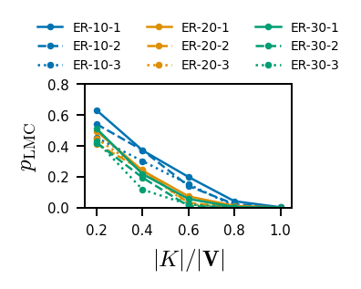

# Toward Falsifying Causal Graphs Using a Permutation-Based Test
This repository contains code for the paper

> E. Eulig, A. A. Mastakouri, P. Blöbaum, M. Hardt, and D. Janzing, "Toward Falsifying Causal Graphs Using a Permutation-Based Test", in Proceedings of the AAAI Conference on Artificial Intelligence, 2025.

**Abstract**

Understanding causal relationships among the variables of a system is paramount to explain and control its behavior. For many real-world systems, however, the true causal graph is not readily available and one must resort to predictions made by algorithms or domain experts. Therefore, metrics that quantitatively assess the goodness of a causal graph provide helpful checks before using it in downstream tasks. Existing metrics provide an absolute number of inconsistencies between the graph and the observed data, and without a baseline, practitioners are left to answer the hard question of how many such inconsistencies are acceptable or expected. Here, we propose a novel consistency metric by constructing a baseline through node permutations. By comparing the number of inconsistencies with those on the baseline, we derive an interpretable metric that captures whether the graph is significantly better than random. Evaluating on both simulated and real data sets from various domains, including biology and cloud monitoring, we demonstrate that the true graph is not falsified by our metric, whereas the wrong graphs given by a hypothetical user are likely to be falsified.

## Table of Contents
- [Installation](#installation)
- [Demo](#demo)
- [Experiments](#experiments)
- [APM data set](#apm-data-set)
- [DoWhy Implementation](#dowhy-implementation)
- [Reference](#reference)

## Installation
1. Set up a new environment with Python 3.10 or higher. We recommend using a virtual environment to avoid conflicts with other packages.
2. Clone this repository: `git clone https://github.com/eeulig/dag-falsification`
3. Install the package with `pip install .`

> [!NOTE]  
> Installing pygraphviz can cause problems. Make sure that graphviz is installed prior to installing pygraphviz. The following should work:
>
> **On MacOS**
> ```
> brew install graphviz
> pip install --no-cache-dir --config-settings="--global-option=build_ext" --config-settings="--global-option=-I$(brew --prefix graphviz)/include/" --config-settings="--global-option=-L$(brew --prefix graphviz)/lib/" pygraphviz
> ```
> **On Linux**
> ```
> sudo apt install graphviz libgraphviz-dev graphviz-dev pkg-config
> pip install --global-option=build_ext --global-option="-I/usr/local/include/graphviz/" --global-option="-L/usr/local/lib/graphviz" pygraphviz
> ```
## Demo
A demo of the method on the real-world data considered in our paper is provided in `demo.ipynb`. You can start it by calling `jupyter notebook` in the root folder.

## Experiments
In `experiments` we provide code to run experiments on synthetic and real data. For this you must provide one of the config files located in `experiments/configs` to `experiments/run_with_config.py` E.g. to run experiments on ER graphs with linear mechanisms and DE-V run: 
```
python experiments/run_with_config.py experiments/configs/de-n_synthetic_linear.json
```
To then plot the results of this experiment, run:
```
python experiments/plot_synthetic_results.py --domain-experts de-n --mechanisms linear
```
which results in the following plot saved to `results/plots`

<picture>
  <source media="(prefers-color-scheme: dark)" srcset="results/plots/p_lmc_synthetic_linear_de-n_d.png">
  <source media="(prefers-color-scheme: light)" srcset="results/plots/p_lmc_synthetic_linear_de-n_l.png">
  
</picture>

## APM dataset
We provide the APM data used in the paper in `falsifydags/data/APM_data.csv` and the corresponding DAG (inverse of the call graph) in `falsifydags/data/APM_g_true.gml`. The dataset can be loaded via

```python
from falsifydags.datasets import load_apm_data
data, g_true = load_apm_data()
```

## DoWhy Implementation
This code uses our implementation provided as part of the Python package [DoWhy](https://github.com/py-why/dowhy). For more details on how to use it on your own datasets, please see the [DoWhy documentation](https://www.pywhy.org/dowhy/v0.10/dowhy.gcm.html#dowhy.gcm.falsify.falsify_graph) and this [example notebook](https://www.pywhy.org/dowhy/v0.10/example_notebooks/gcm_falsify_dag.html).

## Reference
if you find this project useful for your work, please cite our [arXiv preprint](https://arxiv.org/pdf/2305.09565):
```bibtex
@article{dag-falsification,
    title={Toward Falsifying Causal Graphs Using a Permutation-Based Test}, 
    author={Elias Eulig and Atalanti A. Mastakouri and Patrick Blöbaum and Michaela Hardt and Dominik Janzing},
    year={2023},
    eprint={2305.09565},
    archivePrefix={arXiv},
    primaryClass={stat.ML},
    url={https://arxiv.org/abs/2305.09565}, 
}
```