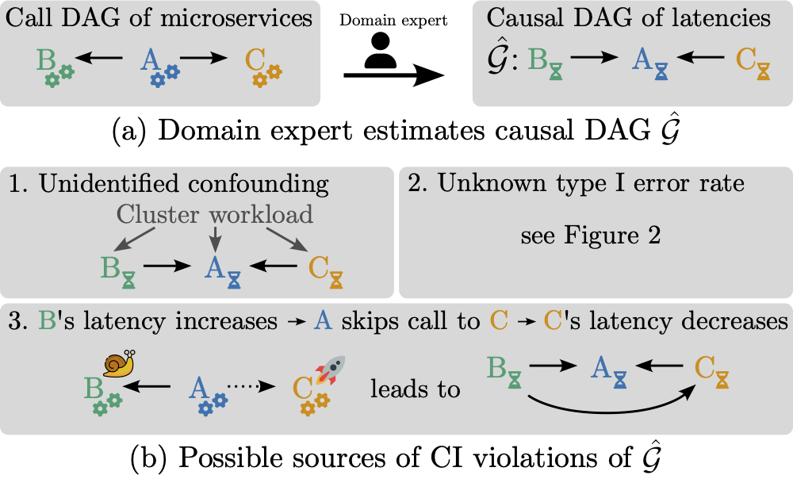

### Abstract
Understanding causal relationships among the variables of a system is paramount to explain and control its behavior. For many real-world systems, however, the true causal graph is not readily available and one must resort to predictions made by algorithms or domain experts. Therefore, metrics that quantitatively assess the goodness of a causal graph provide helpful checks before using it in downstream tasks. Existing metrics provide an *absolute* number of inconsistencies between the graph and the observed data, and without a baseline, practitioners are left to answer the hard question of how many such inconsistencies are acceptable or expected. Here, we propose a novel consistency metric by constructing a baseline through node permutations. By comparing the number of inconsistencies with those on the baseline, we derive an interpretable metric that captures whether the graph is significantly better than random. Evaluating on both simulated and real data sets from various domains, including biology and cloud monitoring, we demonstrate that the true graph is not falsified by our metric, whereas the wrong graphs given by a hypothetical user are likely to be falsified.


(a) For monitoring micro-service architectures, domain experts may invert the call graph to obtain a causal graph of latencies and error rates; (b) However, there are multiple reasons why this graph might violate independence statements on observed data. Notably, even if the predicted causal graph is correct, type I errors of the conditional independence tests will inevitably lead to inconsistencies between the graph and the data. Without a baseline of how many such inconsistencies are to be expected, it is difficult to assess the quality of a given causal graph.

### Implementation in DoWhy
We provide an implementation of our metric as part of the Python package [DoWhy](https://github.com/py-why/dowhy). For more details on how to use it on your own datasets, please see the DoWhy [documentation](https://www.pywhy.org/dowhy/v0.10/dowhy.gcm.html#dowhy.gcm.falsify.falsify_graph) and this [notebook](https://www.pywhy.org/dowhy/v0.10/example_notebooks/gcm_falsify_dag.html).


### Contact and Reference
Please contact [Elias Eulig](mailto:contact@eeulig.com?subject=[GitHub]%20DAG%20Falsification) for questions about our work. If you use our metric in your research, please cite our arXiv preprint:
```
@article{dag-falsification,
    title={Toward Falsifying Causal Graphs Using a Permutation-Based Test}, 
    author={Elias Eulig and Atalanti A. Mastakouri and Patrick Blöbaum and Michaela Hardt and Dominik Janzing},
    year={2023},
    eprint={2305.09565},
    archivePrefix={arXiv},
    primaryClass={stat.ML},
    url={https://arxiv.org/abs/2305.09565}, 
}
```